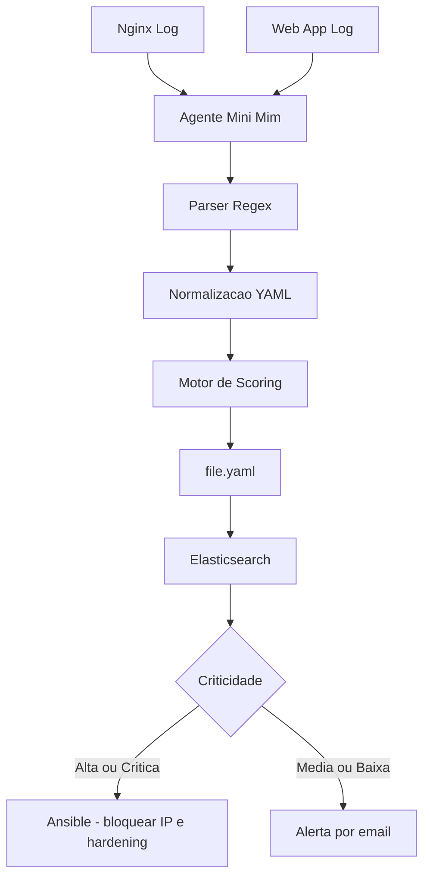

# Nerdy — Security Intelligence Platform


> Sistema de análise de logs de segurança com parsing automatizado, classificação de criticidade por score e resposta baseada em risco — evoluindo de monitoramento SSH para análise de aplicações web e servidor Nginx.

---

## Visão geral
<p align="center">
    
</p>

O Nerdy nasceu como um SIEM simplificado para logs SSH e está sendo expandido para cobrir análise de tráfego web e logs de servidor Nginx. O sistema lê logs incrementalmente via agente (Mini Mim), faz parsing com Regex, classifica cada evento por score de criticidade e — dependendo do nível — dispara resposta automatizada via Ansible ou alerta o administrador por e-mail.

A branch `dev` representa a transição ativa: saindo do escopo exclusivo de SSH para um pipeline genérico capaz de processar logs de aplicação web e Nginx, com os mesmos princípios de scoring e resposta.

---

## Arquitetura



---

## Campos normalizados por evento

| Campo | Descrição | Exemplo |
|---|---|---|
| `usuario` | Usuário alvo da tentativa | `root`, `admin` |
| `ip_origem` | IP de origem do acesso | `192.168.1.105` |
| `endereco_servidor` | Host destino monitorado | `10.0.0.1` |
| `porta` | Porta de conexão | `22`, `80`, `443` |
| `pid` | PID do processo no servidor | `4821` |
| `tentativas` | Contador de tentativas do IP | `47` |
| `resumo_log` | Classificação do evento | `Failed password`, `GET /admin` |
| `criticidade` | Score calculado | `Alto` |

---

## Sistema de scoring

O score é calculado somando pesos de múltiplos fatores:

```
score = peso_usuario + peso_ip + peso_tentativas + peso_contexto_log

Contextos que elevam o score automaticamente para crítico:
  • "Password Accepted"   → acesso bem-sucedido fora dos parâmetros
  • score > 7             → ativo mínimo de resposta
  • score > 10            → ativa resposta via Ansible
```

---

## Pré-requisitos

| Componente | Versão mínima |
|---|---|
| Python | 3.10+ |
| pip | 22+ |
| Nginx (para análise de logs web) | 1.18+ |
| Ansible (para resposta automatizada) | 2.9+ |
| Elasticsearch (opcional) | 8.x |

```bash
# Verificar versão do Python
python3 --version

# Instalar dependências
pip install -r requirements.txt
```

---

## Instalação e uso

### 1. Clone a branch de homologação

```bash
git clone -b dev https://github.com/Theo-Panella/Nerdy.git
cd Nerdy
```

### 2. Instale as dependências

```bash
pip install -r requirements.txt
```

### 3. Configure os parâmetros conhecidos

Edite o bloco de parâmetros no `main.py` com os IPs e usuários confiáveis do seu ambiente:

```python
# IPs e usuários considerados dentro dos parâmetros normais
IPS_CONHECIDOS = ["192.168.1.1", "10.0.0.5"]
USUARIOS_CONHECIDOS = ["deploy", "backup_user"]
```

### 4. Aponte para o arquivo de log

Para logs SSH:
```bash
# Padrão Linux
LOG_PATH = "/var/log/auth.log"
```

Para logs Nginx:
```bash
# Access log
LOG_PATH = "/var/log/nginx/access.log"

# Error log
LOG_PATH = "/var/log/nginx/error.log"
```

### 5. Execute o agente

```bash
# Execução direta
python3 main.py

# Execução como serviço (recomendado em produção)
sudo systemctl start nerdy
```

### 6. Verifique a saída

Os eventos normalizados são exportados em `file.yaml`:

```yaml
- usuario: root
  ip_origem: 203.0.113.42
  porta: "22"
  tentativas: 47
  resumo_log: Failed password
  criticidade: Alto
  score: 11
```

---

## Estrutura do projeto

```
Nerdy/
├── main.py                  # Agente principal — leitura, parsing e scoring
├── file.yaml                # Saída normalizada dos eventos analisados
├── logs.txt                 # Arquivo de log de exemplo para testes
├── nerdy-web/               # Interface web para visualização dos eventos
│   └── ...
├── requirements.txt         # Dependências Python
└── README.md
```

---

## Evolução do projeto — roadmap de branches

| Branch | Escopo | Status |
|---|---|---|
| `main` | Análise de logs SSH simplificada | Estável |
| `dev` | Integração de Elastic Search + Score (evento + contexto) + Servidor nginx + Dasboard de gerenciamento | Experimental |

**Próximas evoluções planejadas:**
- Ingestão em tempo real via streaming (substituindo leitura em batch)
- Indexação no Elasticsearch para correlação de eventos em volume
- Integração com LLM para análise contextual e recomendações
- Dashboard web em tempo real (`nerdy-web`)
- Resposta automatizada via Ansible para eventos críticos (bloqueio de IP, honeypot, hardening de firewall)

---

## O que aprendi

**Regex como ferramenta de inteligência, não só de extração.**
Construir parsers para SSH foi direto. Expandir para Nginx evidenciou que formatos de log diferentes exigem estratégias diferentes de extração — o combined log format do Nginx tem campos que o syslog do SSH não tem (método HTTP, status code, user-agent). Aprendi a estruturar o parser de forma modular para que cada fonte de log tenha sua própria expressão sem quebrar as outras.

**Score de criticidade é um problema de pesos, não de regras binárias.**
A primeira versão do Nerdy usava `if IP não está na lista → criticidade alta`. Isso gerava ruído em excesso. Implementar um sistema de score acumulativo — onde múltiplos fatores de baixo risco podem compor um evento de alto risco — reduziu drasticamente os falsos positivos e tornou o sistema mais próximo de como SIEMs comerciais funcionam de verdade.

**Leitura incremental de log é diferente de leitura de arquivo.**
`open(file).readlines()` lê o snapshot do arquivo. Um agente de monitoramento real precisa de `tail -f` behavior — ler apenas novas linhas conforme o arquivo cresce, sem reprocessar eventos anteriores. Implementar isso com controle de posição de cursor foi a mudança que transformou o projeto de PoC em algo operacionalmente viável.

**Normalização antes da análise resolve o problema de escala.**
Exportar para YAML estruturado antes de qualquer análise complexa cria uma camada de abstração que separa coleta de decisão. Isso permitiu que a integração com Elasticsearch fosse planejada sem reescrever a lógica de parsing — os dados já estão no formato certo.

---

## Referências

- [Python `re` — Regular expression operations](https://docs.python.org/3/library/re.html)
- [Nginx Log Formats](https://nginx.org/en/docs/http/ngx_http_log_module.html)
- [Elasticsearch Python Client](https://www.elastic.co/guide/en/elasticsearch/client/python-api/current/index.html)
- [Ansible Documentation](https://docs.ansible.com/)
- [MITRE ATT&CK — Log Analysis](https://attack.mitre.org/)

---

*Desenvolvido por [Theo Panella](https://github.com/Theo-Panella) · Limeira, São Paulo*
